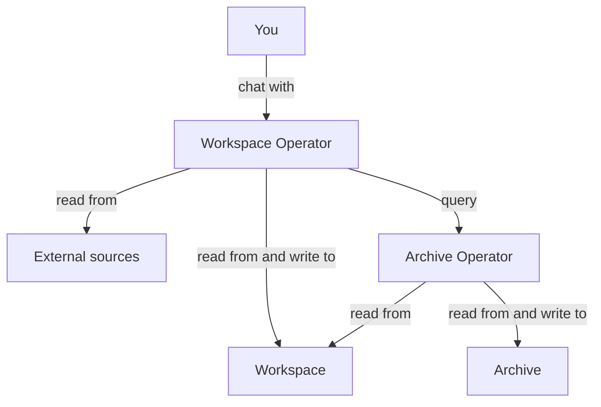
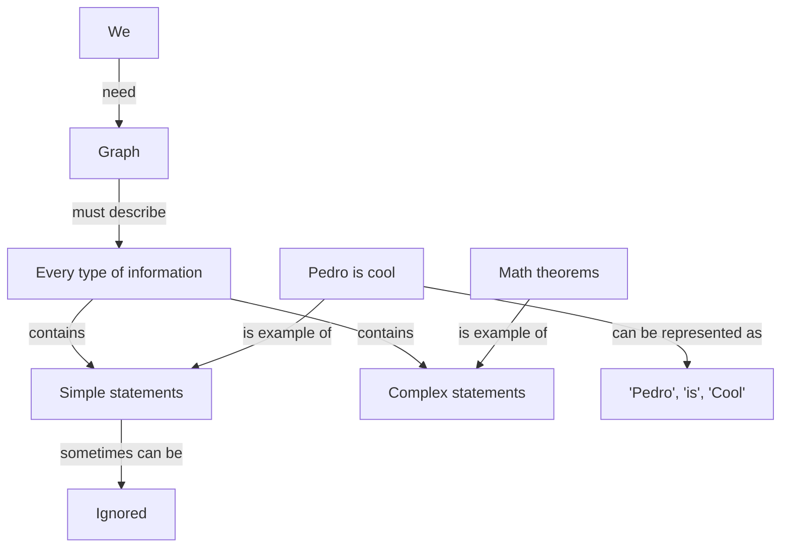
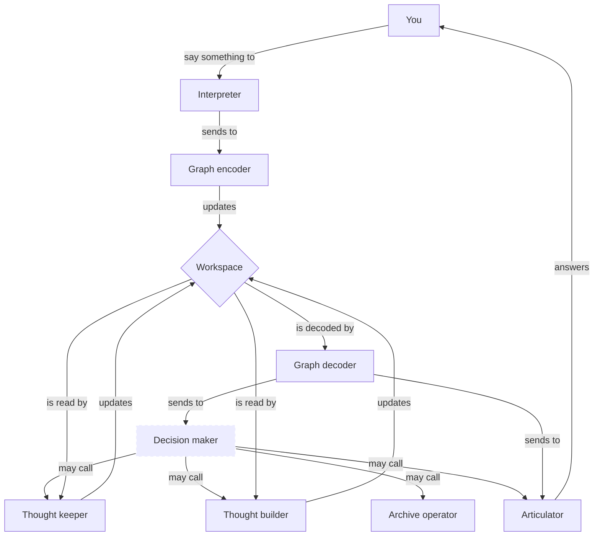

# Mentatus

It's a human-like bot. It can think, search, learn, answer, remember, and forget. 

Disclaimers:
1. The bot will be completely trained on Brazilian Portuguese language. The entire method will be described here. Feel free to retrain it for your own language.
2. It's a WIP project. For now there's only specifications. Currently, the bot doesn't even exist.
3. Some features will not be implemented on 1.0. If that's the case, there will be a warning.

## How it works?

### Overview

> Warning: Archive & Archive Operator will not be implemented on 1.0.

### Workspace

There's a graph called **Workspace** that stores raw information and serves as workspace for thoughts. It's small. Usually the entire graph is loaded as context.

We need this graph to describe every type of information, from simple statements like "Pedro is cool" as ("Pedro", "is", "cool"), to very complex statements like math theorems. Sometimes simple statements can be ignored.

Example:

### Workspace Operator

There's an operator called **Workspace Operator** that works on Workspace and retrieve information from Archive and from external sources on demand. It receives external information and make decisions. It's the decision-maker.

> Warning: External information gathering will not be implemented on 1.0.

It consists of multiple operators.
1. **Interpreter**: It receives the _user input_ and parses it into cleaner and easier-to-undertand phrases.
2. **Graph encoder**: It receives phrases and updates the workspace from it.
3. **Graph decoder**: It receives the workspace and parses to phrases.
4. **Decision maker**: It receives the _user input_ and the decoded workspace to decide between organizing thoughts, thinking more about it, querying the archive operator, or answering.
5. **Thought keeper**: It receives the workspace and improve it by deduplicating entities, delete information that seems to confuse more than help, and simplify chain of thoughts (It may be splitted into multiple operators in the future).
6. **Thought builder**: It receives the workspace and add new thoughts or informations to it.
7. **Articulator**: It receives the decoded workspace and the _user input_ to figure out an answer.

### Archive
> Warning: Archive will not be implemented on 1.0.

There's a graph called **Archive** that stores organized and curated information. It can be potentially huge and slower to retrieve information from.

Since it can be huge, we must allow selecting subgraphs without decontextualization. To solve it we have a special property into some edges called "required_for_complete_info". If it's true between A and B we cannot choose a subgraph with A without B.

### Archive Operator
> Warning: Archive Operator will not be implemented on 1.0.

There's an operator called **Archive Operator** that works organizing information from workspace and sending to Archive. It identifies duplicated entities, deletes information that seems to confuse more than help, simplifies and improves chain of thoughts, and sends consolidated information to the Archive.

## How to run
> Warning: For now it's not working.

You need to install the [prerequisites](https://memgraph.github.io/pymgclient/introduction.html#build-prerequisites) of `gqlalchemy`. After it, just install everything using `pip install -r requirements.txt`.