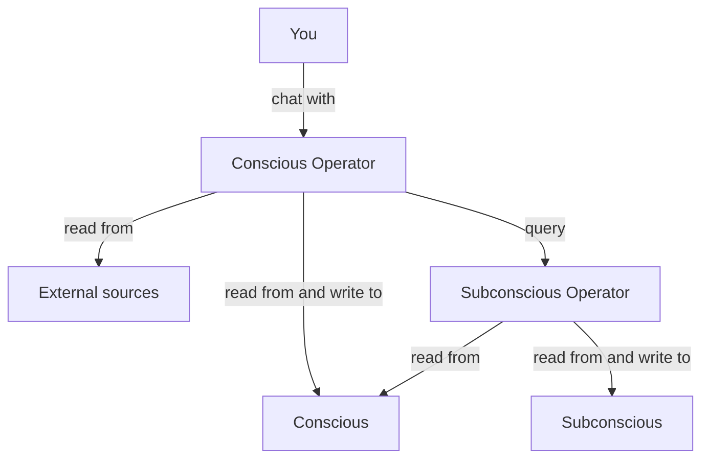
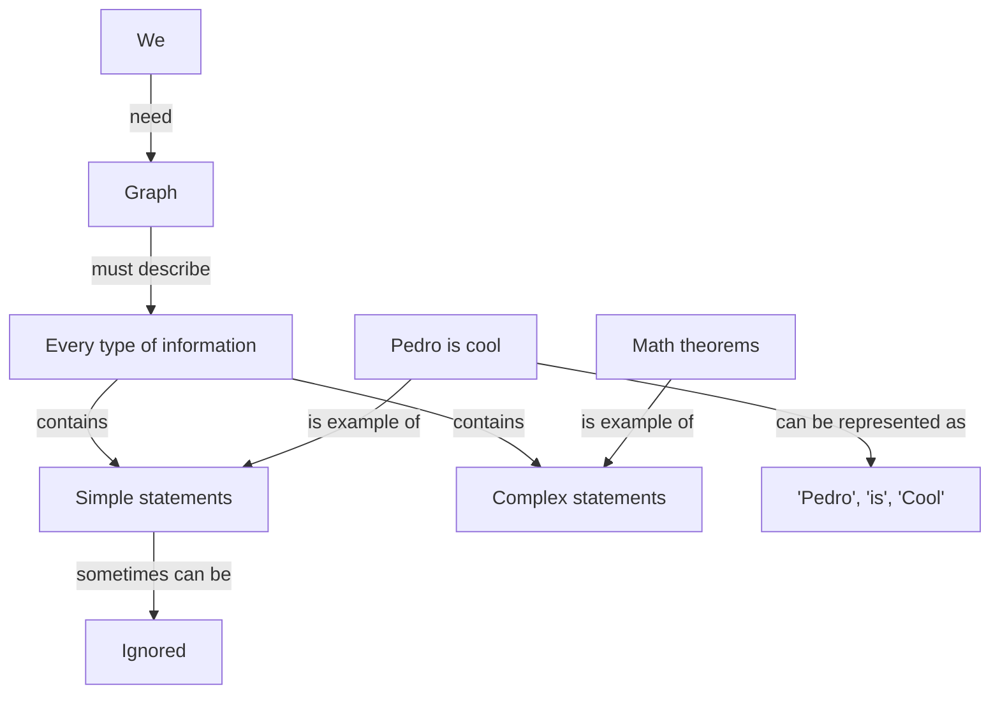
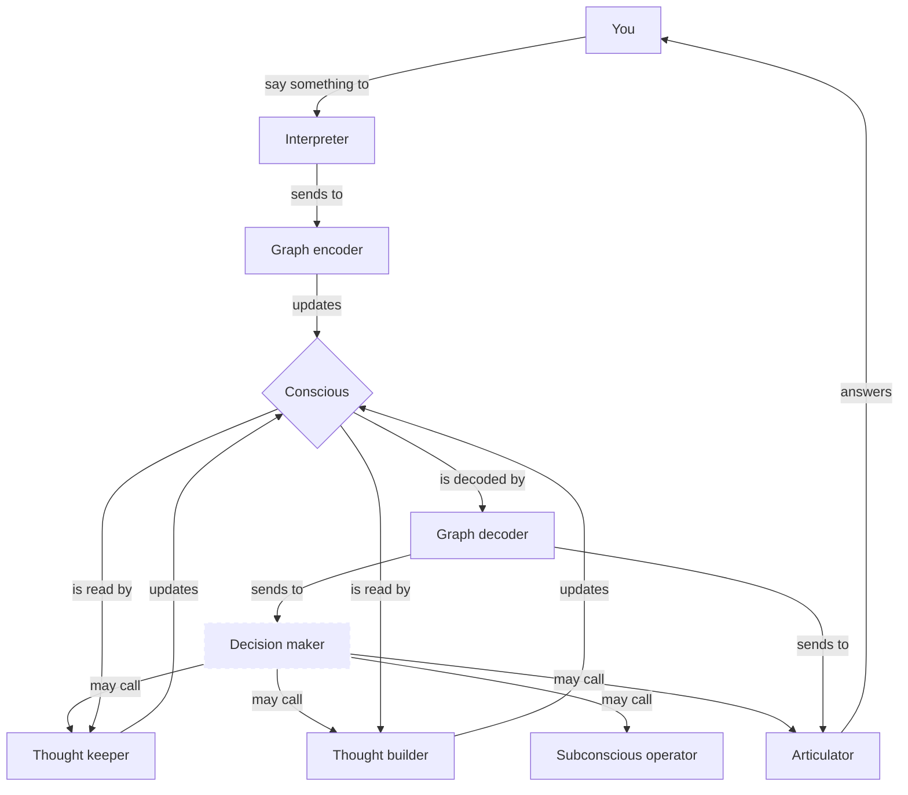

# Cletron

It's a human-like bot. It can think, search, learn, answer, remember, and forget. 

Disclaimers:
1. The bot is completely trained on Brazilian Portuguese language. The entire method is described here. Feel free to retrain for you own language.
2. It's a WIP project. Currently the bot doesn't even exist.
3. Some features will not be implemented on 1.0. If it's the case, will there will be a warning.

## How it works?

### Overview

> Warning: Subconscious & Subconscious Operator will not be implemented on 1.0.

### Conscious

There's a graph called **conscious** that stores raw information and serves as workspace for thoughts. It's small. Usually the entire graph is loaded as context.

We need this graph to describe every type of information from simple statements like "Pedro is cool" as ("Pedro", "is", "cool") to very complex statements like math theorems. Sometimes simple statements can be ignored.

Example:

### Conscious Operator

There's an operator called **conscious operator** that works on conscious and retrieve information from subconscious and from external sources on demand. He receives external information and make decisions. He's the decision-maker.

He's made of multiple operators.
1. **Interpreter**: It receives the _user input_ and parses to cleaner and simpler-to-undertand phrases.
2. **Graph encoder**: It receives phrases and updates the conscious from it.
3. **Graph decoder**: It receives the conscious and parses to phrases.
4. **Decision maker**: It receives the _user input_ and the decoded conscious to decide between organizing thoughts, thinking more about, asking subconscious operator or answering.
5. **Thought keeper**: It receives the conscious and improve it by deduplicating entities, delete information that seems to confuse more than help, and simplify chain of thoughts (It may be splitted into multiple operators in the future).
6. **Thought builder**: It receives the conscious and add new thoughts or informations to it.
7. **Articulator**: It receives the decoded conscious and the _user input_ to figure out an answer.

### Subconscious
> Warning: Subconscious will not be implemented on 1.0.

There's a graph called **subconscious** that stores organized and curated information. It can be potentially huge and slower to retrieve information from.

Since it can be huge, we must allow selecting subgraphs without decontextualization. To solve it we have a special property into some edges called "required_for_complete_info". If it's true between A and B we cannot choose a subgraph with A without B.

### Subconscious Operator
> Warning: Subconscious Operator will not be implemented on 1.0.

There's an operator called **subconscious operator** that works organizing information from conscious and sending to subconscious. It identify duplicated entities, delete information that seems to confuse more than help, simplify and improve chain of thoughts, and send consolidated information to subconscious.

## How to run
> Warning: For now it's not working.

You need to install the [prerequisites](https://memgraph.github.io/pymgclient/introduction.html#build-prerequisites) of `gqlalchemy`. After it, just install everything using `pip install -r requirements.txt`.