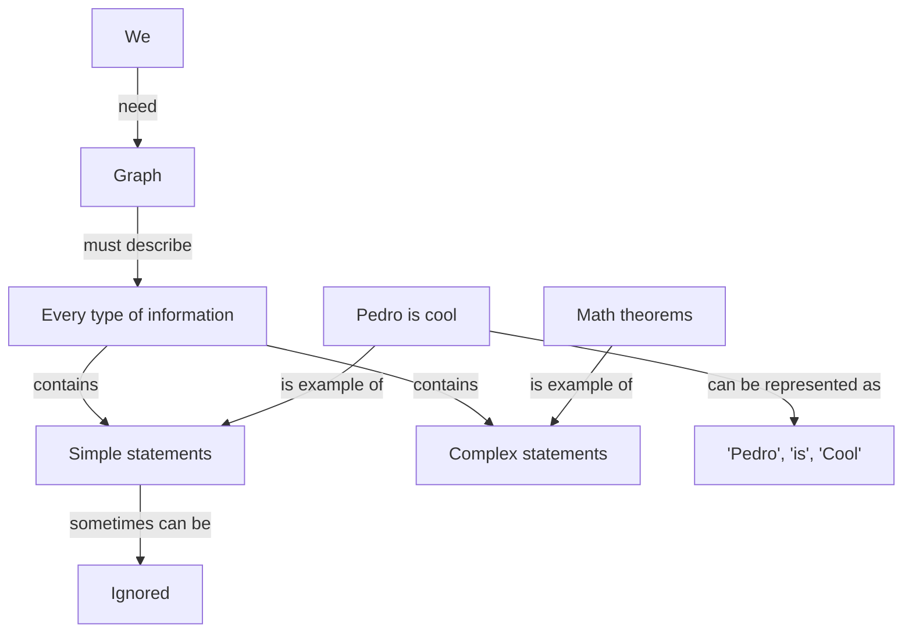
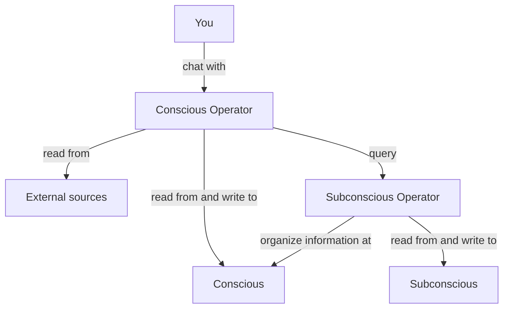

# Cletron

It's a human-like bot. It can search, learn, remember, and forget. 

Note: All prompts are in Portuguese to optimize for my personal use case. Feel free to make translations to work well for other languages.

Note 2: It's a WIP project!

## How it works?

### Conscious

There's a graph called **conscious** that stores raw information and serves as workspace for thoughts. It's small. Usually the entire graph is loaded as context.

We need this graph to describe every type of information from simple statements like "Pedro is cool" as ("Pedro", "is", "cool") to very complex statements like math theorems. Sometimes simple statements can be ignored.

Example:

### Subconscious

There's a graph called **subconscious** that stores organized and curated information. It can be potentially huge and slower to retrieve information from.

Since it can be huge, we must allow selecting subgraphs without decontextualization. To solve it we have a special property into some edges called "required_for_complete_info". If it's true between A and B we cannot choose a subgraph with A without B.

### Conscious Operator

There's an operator called **conscious operator** that works on conscious and retrieve information from subconscious and from external sources on demand. He receives external information and make decisions. He's the decision-maker.

### Subconscious Operator

There's an operator called **subconscious operator** that works organizing information from conscious and sending to subconscious. It identify duplicated entities, delete information that seems to confuse more than help, simplify and improve chain of thoughts, and send consolidated information to subconscious.

### Overview

## How to run

You need to install the [prerequisites](https://memgraph.github.io/pymgclient/introduction.html#build-prerequisites) of `gqlalchemy`. After it, just install everything using `pip install -r requirements.txt`.